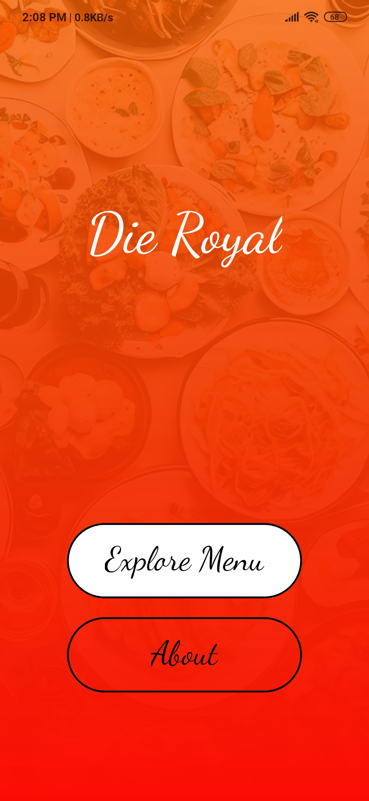
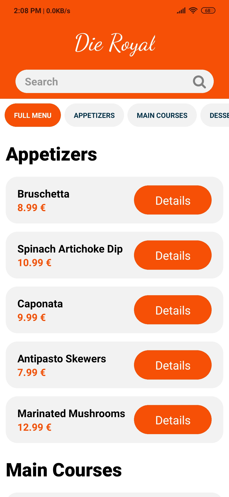
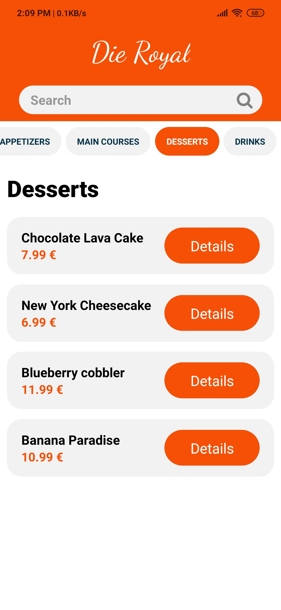
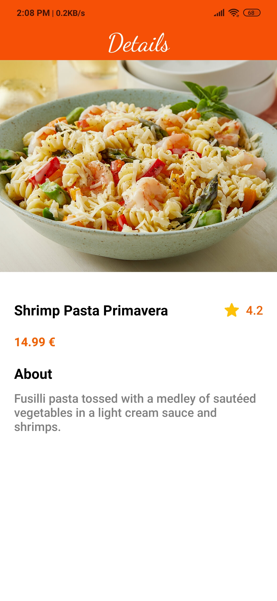
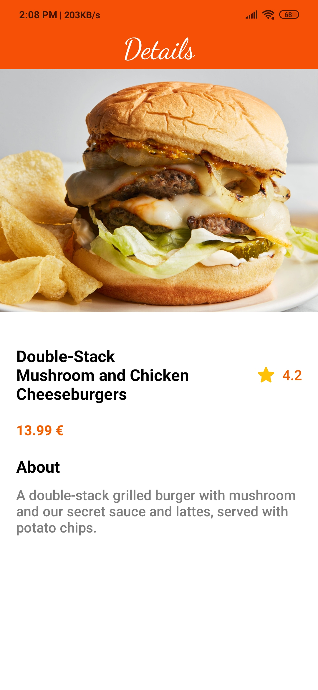
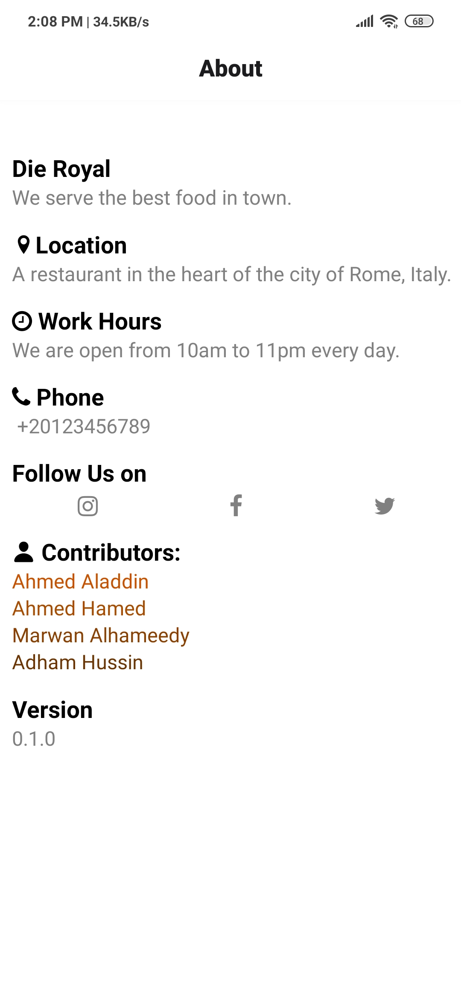

  

# El-Menu 
El-Menu, an application designed for Restaurants and Café so that they are able to show their menus in a nicely organized app view.

## Why El-Menu?
- Beautiful UI design
- Easy to use
- Filtering options
- Search functionality

## Screenshots

  
  
  
  
  
  
  

## How to run the repository?
1. Clone the repository
2. Run `npm install` in the root folder
3. Run `npx expo start` in the root folder
4. A QR code will appear
5. From the Expo application on your IPone or Android phone, scan the QR code to experience El-Menu on your device